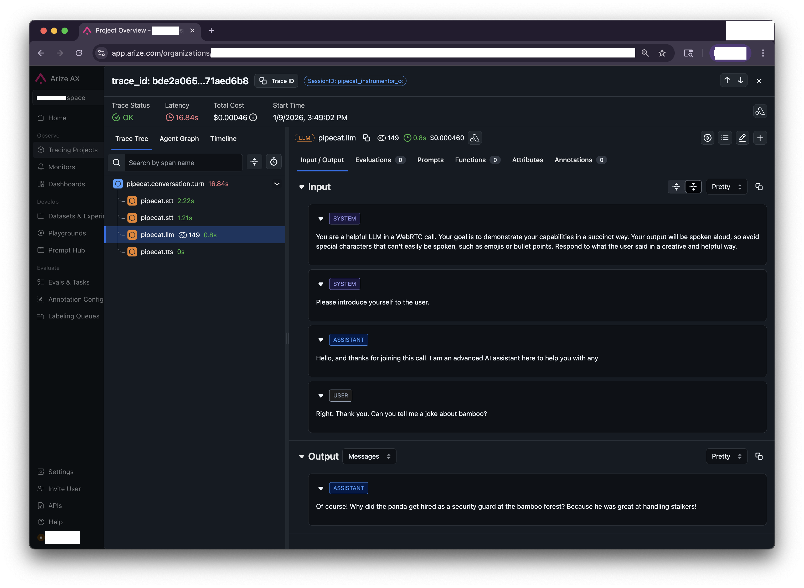

# Openinference Tracing for Pipecat with Arize

This demo showcases [Arize](https://arize.com/) tracing integration for Pipecat services via [OpenInference](https://arize-ai.github.io/openinference/), instrumentation compatible with OpenTelemetry. It allows you to visualize service calls, performance metrics, and dependencies with a focus on LLM observability.

One can run this demo using Arize's hosted backend or self-hosted Phoenix or local development Phoenix server. This example covers Arize and local dev Phoenix.



## General Setup

### 2. Environment Configuration

Create a `.env` file with your API keys:

```
# Service API keys
DEEPGRAM_API_KEY=your_key_here
CARTESIA_API_KEY=your_key_here
GOOGLE_API_KEY=your_google_key
```

### 3. Set up a venv and install Dependencies

```bash
uv sync
```

## Arize Setup Instructions

> [!TIP]
> Skip this step if you would like to use _only_ Phoenix.

### 1. Create an Arize Account

See [arize.com](https://arize.com/).

### 2. Environment Configuration

Add API keys:

```
# Arize-ai Keys
ARIZE_API_KEY=
ARIZE_SPACE_ID=
ARIZE_PROJECT_NAME=
```
## Phoenix Setup Instructions (local dev)

### 1. Start Phoenix Server

```bash
uv sync --group phoenix
phoenix serve
```

### 2. Environment Configuration (Optional)

Add API keys:

```
# Phoenix Keys
PHOENIX_PROJECT_NAME=
PHOENIX_SPACE_ID=
PHOENIX_API_KEY=
PHOENIX_COLLECTOR_ENDPOINT=http://localhost:6006
```

## Run the Demo

```bash
uv run bot.py
```

## View Traces

#### Arize-ai dashboard

Open your browser to [http://app.arize.com/](http://app.arize.com/) to view traces.

#### Phoenix dashboard

Open your browser to [http://localhost:6006](http://localhost:6006) to view traces.

## Troubleshooting Tips

By default a debug log file is generated locally. Look at `pipecat-test-conversation-001_....log` to ensure span creation is working.

## References

- [openinference-instrumentation-pipecat](https://github.com/Arize-ai/openinference/tree/main/python/instrumentation/openinference-instrumentation-pipecat)
- [Arize-Phoenix](https://github.com/Arize-ai/phoenix)