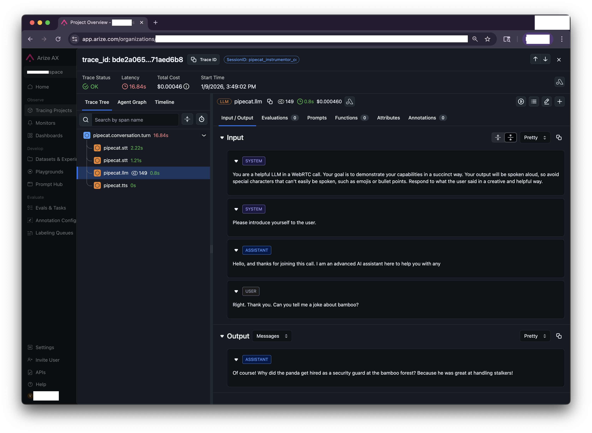

# OpenInference Tracing for Pipecat with Arize

This demo showcases [Arize](https://arize.com/) tracing integration for Pipecat services via [OpenInference](https://arize-ai.github.io/openinference/), instrumentation compatible with OpenTelemetry. It allows you to visualize service calls, performance metrics, and dependencies with a focus on LLM observability.

One can run this demo using Arize's hosted backend or self-hosted Phoenix or local development Phoenix server. This example covers Arize and local dev Phoenix.

Each conversation turn span also carries `audio.user.url` and `audio.bot.url` attributes pointing to S3-hosted WAVs of just that turn's user utterance and bot reply. `AudioBufferProcessor(enable_turn_audio=True)` fires `on_user_turn_audio_data` / `on_bot_turn_audio_data`; for each event we generate a presigned S3 GET URL synchronously, set it on the active `OpenInferenceObserver._turn_span`, and kick off the actual `put_object` upload as a background task.



## General Setup

### 2. Environment Configuration

Create a `.env` file with your API keys:

```
# Service API keys
DEEPGRAM_API_KEY=your_key_here
CARTESIA_API_KEY=your_key_here
GOOGLE_API_KEY=your_google_key
```

### 3. Set up a venv and install Dependencies

```bash
uv sync
```

## Arize Setup Instructions

> [!TIP]
> Skip this step if you would like to use _only_ Phoenix.

### 1. Create an Arize Account

See [arize.com](https://arize.com/).

### 2. Environment Configuration

Add API keys:

```
# Arize-ai Keys
ARIZE_API_KEY=
ARIZE_SPACE_ID=
ARIZE_PROJECT_NAME=
```
## Phoenix Setup Instructions (local dev)

### 1. Start Phoenix Server

```bash
uv sync --group phoenix
phoenix serve
```

### 2. Environment Configuration (Optional)

Add API keys:

```
# Phoenix Keys
PHOENIX_PROJECT_NAME=
PHOENIX_SPACE_ID=
PHOENIX_API_KEY=
PHOENIX_COLLECTOR_ENDPOINT=http://localhost:6006
```

## AWS S3 Setup (for per-turn audio links)

The example uses a **long-lived IAM user** (not assumed-role / STS) so presigned URLs are valid for up to 7 days.

Run the helper script to create the bucket (if it doesn't already exist) and an IAM user with the minimal `s3:PutObject` + `s3:GetObject` policy, and emit access keys:

```bash
AWS_PROFILE=your_aws_profile ./create_s3_user.sh <BUCKET_NAME>
```

Requires `aws` CLI and `jq`. Add the printed `AWS_*` vars to your `.env`:

```
AWS_ACCESS_KEY_ID=
AWS_SECRET_ACCESS_KEY=
AWS_DEFAULT_REGION=us-west-2
AWS_BUCKET_NAME=
# Optional path prefix inside the bucket (default: pipecat-turn-audio)
AWS_S3_PREFIX=pipecat-turn-audio
```

To create the user manually instead, attach this inline policy (substitute `<BUCKET>`):

```json
{
  "Version": "2012-10-17",
  "Statement": [{
    "Effect": "Allow",
    "Action": ["s3:PutObject", "s3:GetObject"],
    "Resource": "arn:aws:s3:::<BUCKET>/*"
  }]
}
```

S3 layout per conversation:

```
s3://<bucket>/<prefix>/<conversation_id>/turn-0001/user.wav
s3://<bucket>/<prefix>/<conversation_id>/turn-0001/bot.wav
s3://<bucket>/<prefix>/<conversation_id>/turn-0002/user.wav
...
```

In the Arize (or Phoenix) trace UI, open a `pipecat.conversation.turn` span and look at its `audio.user.url` / `audio.bot.url` attributes — clickable HTTPS links signed for 7 days by default.

## Run the Demo

```bash
uv run bot.py
```

## View Traces

#### Arize-ai dashboard

Open your browser to [http://app.arize.com/](http://app.arize.com/) to view traces.

#### Phoenix dashboard

Open your browser to [http://localhost:6006](http://localhost:6006) to view traces.

## Troubleshooting Tips

By default a debug log file is generated locally. Look at `pipecat-test-conversation-001_....log` to ensure span creation is working.

## References

- [openinference-instrumentation-pipecat](https://github.com/Arize-ai/openinference/tree/main/python/instrumentation/openinference-instrumentation-pipecat)
- [Arize-Phoenix](https://github.com/Arize-ai/phoenix)