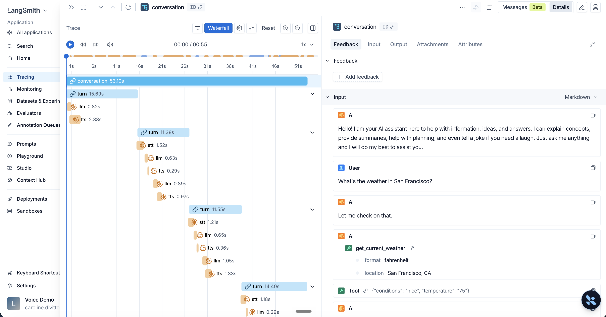

# LangSmith Tracing for Pipecat

This demo showcases [LangSmith](https://smith.langchain.com) tracing integration for Pipecat services via the [LangSmith Pipecat integration](https://docs.langchain.com/langsmith/trace-with-pipecat), allowing you to visualize service calls, performance metrics, and dependencies with a focus on LLM observability.

The integration hooks into the spans Pipecat already emits and maps them onto LangSmith's tracing format, so each conversation becomes a single LangSmith trace, with a span per pipeline stage (STT, LLM, TTS).



> The Pipecat integration requires `langsmith[pipecat]>=0.9.7`. It is currently in beta, so its API may change.

## Setup Instructions

### 1. Create a LangSmith Project and get an API key

Create a free [LangSmith](https://smith.langchain.com) account, then create an API key from your account settings.

### 2. Environment Configuration

Create a `.env` file with your API keys to enable tracing:

```
# LangSmith tracing
LANGSMITH_API_KEY=your_langsmith_key
LANGSMITH_TRACING=true
LANGSMITH_PROJECT=pipecat-voice

# Service API keys
DEEPGRAM_API_KEY=your_key_here
CARTESIA_API_KEY=your_key_here
OPENAI_API_KEY=your_key_here
```

The integration reads your LangSmith credentials from the environment and exports to LangSmith for you via OpenTelemetry — no OTLP endpoint or authorization headers to configure manually.

### 3. Set up a venv and install Dependencies

```bash
uv sync
```

### 4. Run the Demo

```bash
uv run bot.py
```

### 5. View Traces in LangSmith

Open your browser to [https://smith.langchain.com](https://smith.langchain.com) and select your project (`pipecat-voice` by default) to view traces.

## LangSmith-Specific Configuration

In the `bot.py` file, note that tracing is set up with a single call before the
pipeline is built:

```python
from langsmith.integrations.pipecat import configure_pipecat

# Install the tracer and register the LangSmith span processor.
configure_pipecat()
```

Tracing is then enabled on the pipeline worker:

```python
worker = PipelineWorker(
    pipeline,
    params=PipelineParams(
        enable_metrics=True,
        enable_usage_metrics=True,
    ),
    enable_tracing=IS_TRACING_ENABLED,
)
```

Turn tracking is required for tracing, and metrics drive the latency and token
data on each span.

### Using a LangGraph or LangChain agent as the LLM

If your LLM stage is an in-process LangGraph or LangChain agent, its model and
tool runs should nest inside Pipecat's `llm` span rather than forming a separate
trace. To achieve this:

- Pass `configure_pipecat(llm_span_kind="chain")`.
- Set `LANGSMITH_TRACING_MODE=otel` in the environment.

### Recording the conversation audio

This example records the conversation audio with Pipecat's
[`AudioBufferProcessor`](https://docs.pipecat.ai/pipecat/fundamentals/recording-audio)
and attaches it to the LangSmith trace. The processor is placed after
`transport.output()` so it captures what was actually played (after any barge-in
truncation), handed to the integration's span processor, and started once a
client connects:

```python
from pipecat.processors.audio.audio_buffer_processor import AudioBufferProcessor

span_processor = configure_pipecat()

# Stereo: user on the left channel, agent on the right.
audiobuffer = AudioBufferProcessor(num_channels=2, buffer_size=32_000)
span_processor.attach_audio_buffer(audiobuffer, conversation_id=conversation_id)

# ...add audiobuffer to the pipeline after transport.output()...

@transport.event_handler("on_client_connected")
async def on_client_connected(transport, client):
    await audiobuffer.start_recording()
```

The integration attaches the recording to the conversation root when recording
ends. See [Upload files with traces](https://docs.langchain.com/langsmith/upload-files-with-traces)
for the underlying attachment API.

### Grouping a conversation into a thread

To group a conversation's runs into a LangSmith
[thread](https://docs.langchain.com/langsmith/threads) for thread-level views and
token/cost aggregation, call `set_thread_id` once per conversation before its
spans are emitted:

```python
from langsmith.integrations.pipecat import configure_pipecat, set_thread_id

configure_pipecat()
set_thread_id(conversation_id)
```

## Troubleshooting

- **No Traces in LangSmith**: Ensure `LANGSMITH_TRACING=true` and that your `LANGSMITH_API_KEY` is correct.
- **Missing Metrics**: Check that `enable_metrics=True` in `PipelineParams`.
- **Connection Errors**: Verify network connectivity to LangSmith.

## References

- [Trace Pipecat applications with LangSmith](https://docs.langchain.com/langsmith/trace-with-pipecat)
- [Voice tracing fundamentals](https://docs.langchain.com/langsmith/trace-voice-fundamentals)
