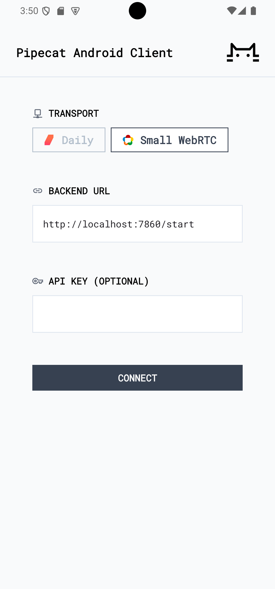
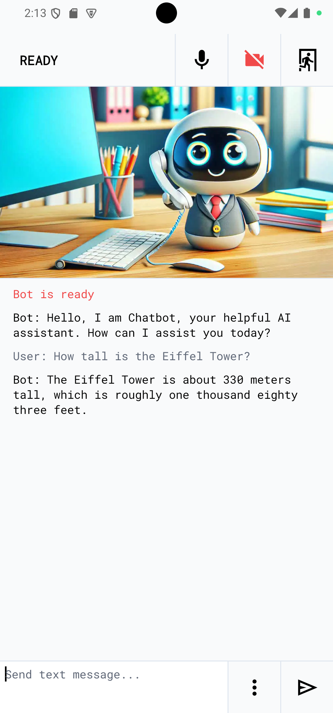

# Pipecat Simple Chatbot Client for Android

Demo app which connects to the `simple-chatbot` backend over RTVI.

## Screenshot

 

## How to run

```bash
# Build and install the app
./gradlew installDebug

# Launch the app
adb shell am start -n ai.pipecat.simple_chatbot_client/.MainActivity
```

Ensure that the `simple-chatbot` server is running as described in the parent README.

Use the command `adb reverse` to forward the necessary ports from your development machine to your Android device, and connect to the start URL:

```
http://localhost:7860/start
```
