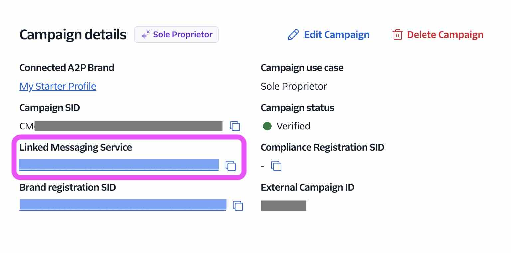

# SMS Verification Bot

A Pipecat voice agent that sends a 6-digit SMS verification code, asks the
caller to read the digits back, and confirms or rejects the match. Runs in two
modes from a single bot file:

| Mode      | Transport          | How the user calls          | Where the SMS goes                |
| --------- | ------------------ | --------------------------- | --------------------------------- |
| Browser   | SmallWebRTC        | Clicks **Call** in browser  | The number typed in the form     |
| Phone     | Twilio Media Stream | Dials your Twilio number    | The caller's number (caller ID)  |

The demo allows one retry; the second failed attempt ends the call.

## How it works

```
┌──────────┐    ┌────────────────────────────────┐    ┌──────────┐
│ Frontend │◄──►│ FastAPI server                 │◄──►│ Twilio   │
│ (HTML/JS)│SSE │  /api/offer (SmallWebRTC)      │SMS │          │
│          │WS  │  /ws/twilio  (Twilio Media WS) │    │          │
└──────────┘    │  /events     (SSE bus)         │    └──────────┘
                │  bot.py — shared run_bot()     │
                └────────────────────────────────┘
```

The bot uses three LLM tools:

- `send_verification_code(phone_number)` — generates a 6-digit code, sends an
  SMS via Twilio, and stores the code in per-call state.
- `verify_code(digits)` — checks the digits the user spoke. On match: emits a
  success event and asks the LLM to wrap up. On mismatch: emits a failure
  event; if a retry is available, sends a fresh code automatically; otherwise
  asks the LLM to wrap up.
- `end_call()` — pushes an `EndTaskFrame` to cleanly terminate.

Results are published two ways at once:

- `RTVIServerMessageFrame` for in-call RTVI clients (Browser mode).
- A simple in-process SSE bus (`/events`) for clients watching from outside the
  call (Phone mode).

> [!NOTE]
> This is a Proof of Concept / Demo, so the SSE bus is single-process 
> and single-caller. To deploy this for multiple concurrent users, 
> key the channel by phone number or per-session token before subscribing.

## Prerequisites

- Python 3.11+, [`uv`](https://docs.astral.sh/uv/), Node 18+
- API keys:
  - **Twilio** account SID, auth token, and a voice-capable phone number that
    can send SMS
  - **Deepgram** (STT), **Cartesia** (TTS), **Google** (LLM, default) — or
    swap to OpenAI; both blocks are present in `bot.py`
- [ngrok](https://ngrok.com/) for local Twilio webhook tunneling

## Setup

```sh
cd sms-verification/server
uv sync
cp env.example .env  # fill in API keys + TWILIO_PHONE_NUMBER

cd ../client
npm install
```

### Configure Twilio A2P Messaging service
> [!IMPORTANT]
> SMS will _not_ work until you have a _verified_ A2P Campaign. This can be a
> multi-day process.

Twilio quickstart for this process [here](https://www.twilio.com/docs/messaging/compliance/a2p-10dlc/quickstart).

Once you have a verified A2P Campaign, add the
`"Linked Messaging Service"` ID as the `TWILIO_MESSAGING_SERVICE_SID` in your `.env`.


### Configure Twilio (for Phone mode only)
Optional. In Browser mode, you can call the bot from the browser and 
pass in the phone number to which you want to receive the SMS verification code.

1. Start ngrok:

   ```sh
   ngrok http 7860
   ```

2. In the [Twilio console](https://console.twilio.com/), open your phone
   number → **Voice configuration** → **A call comes in** → **Webhook**, and
   point it at:

   ```
   https://<your-ngrok-host>/twilio/voice
   ```

   The server replies with TwiML that connects the call's media stream to
   `wss://<your-ngrok-host>/ws/twilio`.

   Alternatively, skip the server and create a TwiML Bin directly pointing the
   `<Stream url>` at your ngrok WSS URL.

## Run

1. In one terminal — start the bot server:

```sh
cd sms-verification/server
uv run python server.py
```

2. In another — start the client dev server:

```sh
cd sms-verification/client
npm run dev
```

3. Open `http://localhost:5173`.

- **Browser mode** (default) — type a phone number that can receive an SMS,
  click **Call**. Talk to the bot in your browser.
- **Phone mode** — switch to the "Call by phone" tab, then call the number
  shown on the page from any phone. The bot picks up, sends an SMS to the
  caller's number, asks you to read it back.

### Demo video

- branch version for PR
[Browser mode demo video](https://raw.githubusercontent.com/pipecat-ai/pipecat-examples/vp-sms-example/sms-verification/z_readme_demo_video.mp4)

- use this link when merged to main
[Browser mode demo video](https://raw.githubusercontent.com/pipecat-ai/pipecat-examples/main/sms-verification/z_readme_demo_video.mp4)

## File layout

```
sms-verification/
├── README.md
├── server/
│   ├── bot.py        # transport-aware run_bot + tool handlers
│   ├── server.py     # FastAPI: Twilio WS + WebRTC offer + SSE
│   ├── sms.py        # Twilio REST SMS helper
│   ├── events.py     # in-memory pub/sub for SSE
│   ├── env.example
│   └── pyproject.toml
└── client/
    ├── index.html
    ├── app.js        # Pipecat JS client (WebRTC) + SSE listener
    ├── style.css
    ├── package.json
    └── vite.config.js
```
