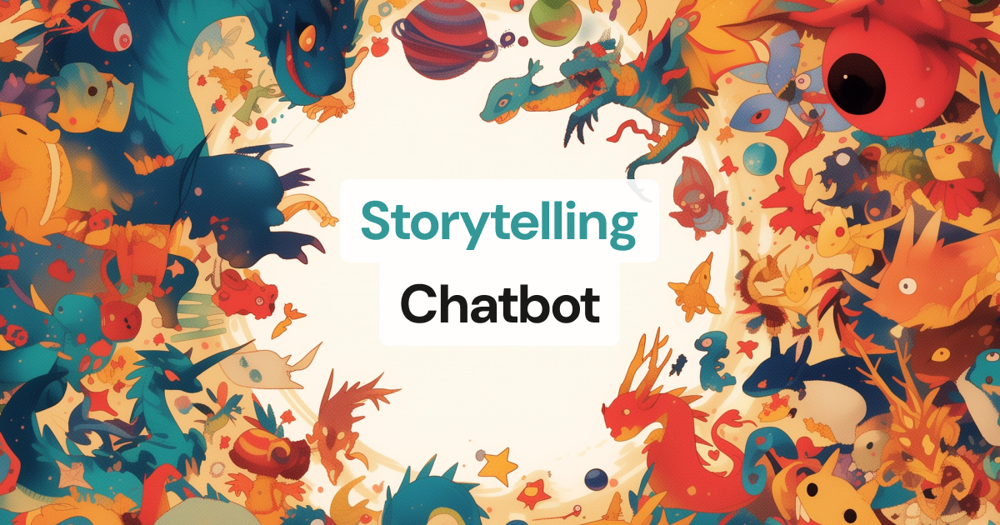

# Storytelling Chatbot



This example shows how to build a voice-driven interactive storytelling experience.
It periodically prompts the user for input for a 'choose your own adventure' style experience.

Gemini writes the story a few sentences at a time and a Gemini image model illustrates each page. The illustrations are streamed to the browser as the bot's video track, so the client is a regular Pipecat web client that happens to show video.

The bot runs locally with the Pipecat development runner over SmallWebRTC and deploys unchanged to [Pipecat Cloud](https://pipecat.daily.co).

---

### It uses the following AI services:

**Deepgram - Speech-to-Text**

Transcribes the user's voice to text.

**Google Gemini - LLM**

Our creative writer LLM. You can see the prompt [here](server/prompts.py). The same service is used out of band (`run_inference`) to turn each story page into an image prompt.

**ElevenLabs - Text-to-Speech**

Narrates the story as it is written.

**Google Gemini image model - Image Generation**

Adds pictures to our story. Prompting is quite key for style consistency, so we task the LLM to turn each story page into a short image prompt. See [gemini_image.py](server/gemini_image.py) for the small `ImageGenService` that wraps the model.

---

## How it works

- `server/bot.py` builds the pipeline: `transport.input() → stt → user_aggregator → llm → story_processor → image_processor → tts → transport.output() → assistant_aggregator`.
- `StoryProcessor` splits the streamed LLM text into story pages on the `[break]` markers the prompt asks for, and sends `user_turn` / `assistant_turn` cues to the client as RTVI server messages.
- `StoryImageProcessor` queues each page to a background task that asks the LLM for an image prompt and generates the illustration, so narration is never held up by image generation.
- The client (Next.js + [Pipecat React SDK](https://docs.pipecat.ai/client/react/introduction)) renders the bot's video track, shows transcripts from the RTVI `UserTranscript` and `BotTtsText` events, and unmutes the mic when it receives the `user_turn` cue.

## Quick Start

To run this demo, you'll need two terminal windows.

### Terminal 1: Server

1. Navigate to the server directory and install dependencies:

   ```shell
   cd server
   uv sync
   ```

2. Create the environment file and set your API keys:

   ```shell
   cp env.example .env
   ```

   You'll need:

   - `DEEPGRAM_API_KEY`
   - `ELEVENLABS_API_KEY` and `ELEVENLABS_VOICE_ID`
   - `GOOGLE_API_KEY`

3. Run the bot:

   ```shell
   uv run bot.py
   ```

   The runner listens on http://localhost:7860 and, by default, keeps every transport enabled. The client uses SmallWebRTC; set `DAILY_API_KEY` if you want to try the Daily transport instead.

### Terminal 2: Client

1. Navigate to the client directory and install dependencies:

   ```shell
   cd client
   npm install
   ```

2. Create the environment file:

   ```shell
   cp env.example .env.local
   ```

   The defaults point at the local runner.

3. Start the client:

   ```shell
   npm run dev
   ```

4. Open http://localhost:3000, pick your microphone and click **Let's begin!**

Each story ends after five minutes by default; change `MAX_SESSION_SECS` in `server/.env` to adjust (0 disables the limit).

## Deploy to Pipecat Cloud

1. Sign up for [Pipecat Cloud](https://pipecat.daily.co) and make sure Docker is running.

2. From the `server` directory, upload your `.env` as a secret set and deploy. `pcc-deploy.toml` names the agent `storytelling-chatbot`, requests the `agent-2x` profile (image generation and a 1024x1024 video track are CPU heavy) and keeps one warm instance:

   ```shell
   cd server
   uv run pcc auth login
   uv run pcc secrets set storytelling-chatbot-secrets --file .env
   uv run pcc deploy
   ```

   The Dockerfile installs from `uv.lock`, so run `uv sync` (or `uv lock`) before deploying.

3. Point the client at your agent by editing `client/.env.local`:

   ```shell
   BOT_START_URL="https://api.pipecat.daily.co/v1/public/storytelling-chatbot/start"
   BOT_START_PUBLIC_API_KEY="pk_..."
   ```

   The Next.js API routes under `client/app/api` forward the start request and the WebRTC offer to Pipecat Cloud, so the public key never reaches the browser. Deploy the client anywhere that runs Next.js (Vercel, for example) with those two environment variables set.

See the [Pipecat Cloud quickstart](https://docs.pipecat.ai/getting-started/quickstart#step-2%3A-deploy-to-production) for more details.
